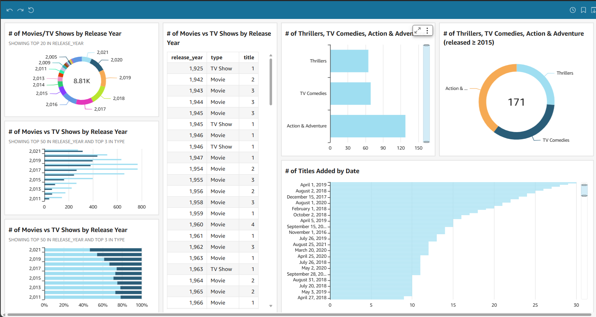

# Netflix Data Analysis with AWS QuickSight 📊
This repository showcases a data analysis project on Netflix movies and TV shows, performed using AWS QuickSight. The project focuses on trends, release years, categories, and the platform's catalog additions.

# Dashboard Screenshot 📸
# Below is the dashboard created during the analysis:

# Key Features of the Analysis:
Breakdown by Release Year: Visualized trends in movies and TV shows released each year.
Genre Insights: Analyzed popular categories like Action & Adventure, TV Comedies, and Thrillers.
Catalog Additions: Identified the dates with the largest number of additions to the Netflix catalog.
# Tools Used 🛠️
AWS QuickSight: For data visualization and dashboard creation.
Python: Data preprocessing and preparation.
Netflix Dataset: Extracted insights from a dataset of Netflix movies and TV shows.
